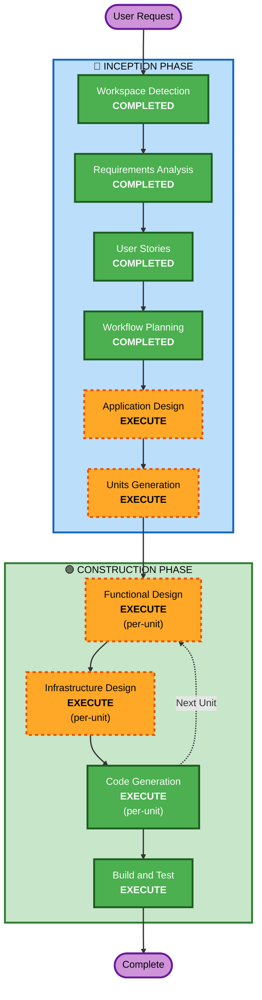

# Execution Plan — App de Adopción de Mascotas

**Generated**: 2026-06-30
**Stage**: INCEPTION — Workflow Planning
**Project Type**: Greenfield

---

## Detailed Analysis Summary

### Change Impact Assessment

| Área de Impacto | Aplica | Descripción |
|---|---|---|
| **Cambios user-facing** | Sí | Toda la funcionalidad es nueva y orientada al usuario final (catálogo, solicitudes, gestión) |
| **Cambios estructurales** | Sí | Arquitectura serverless completa desde cero (Lambda + API Gateway + DynamoDB + S3 + Cognito) |
| **Cambios de modelo de datos** | Sí | 3 entidades nuevas (User, Pet, AdoptionRequest) con GSIs y access patterns definidos |
| **Cambios de API** | Sí | API REST completa nueva (endpoints para todas las 10 features) |
| **Impacto en NFR** | Bajo | Best-effort POC; NFRs mínimos cubiertos por defaults de AWS |

### Risk Assessment

| Factor | Valor | Justificación |
|---|---|---|
| **Nivel de riesgo** | Bajo | POC greenfield sin usuarios existentes, sin datos legacy, stack conocido |
| **Complejidad de rollback** | No aplica | No hay sistema previo; si falla, se redespliega |
| **Complejidad de testing** | Moderada | Múltiples flujos de estado, 3 roles, interacciones entre entidades |

---

## Phase Determination

### 🔵 INCEPTION PHASE

| Stage | Decisión | Razonamiento |
|---|---|---|
| Workspace Detection | ✅ COMPLETED | Greenfield confirmado |
| Reverse Engineering | ⏭️ SKIPPED | Greenfield — no hay código existente |
| Requirements Analysis | ✅ COMPLETED | 10 FR + 5 NFR documentados |
| User Stories | ✅ COMPLETED | 22 historias, 3 personas |
| Workflow Planning | 🔄 IN PROGRESS | Este documento |
| **Application Design** | ✅ **EXECUTE** | Nuevos componentes (Frontend, Backend, IaC), service layer, business rules y relaciones entre entidades necesitan diseño |
| **Units Generation** | ✅ **EXECUTE** | Sistema multi-capa (Frontend/Backend/Infra) requiere descomposición en unidades para desarrollo estructurado |

### 🟢 CONSTRUCTION PHASE (per-unit)

| Stage | Decisión | Razonamiento |
|---|---|---|
| **Functional Design** | ✅ **EXECUTE** | Modelos de datos, state machine de adopción, reglas de negocio (waitlist, límites, cascada) requieren diseño detallado |
| NFR Requirements | ⏭️ SKIP | NFRs mínimos (best-effort); tech stack ya determinado; extensiones Security y Resiliency deshabilitadas |
| NFR Design | ⏭️ SKIP | NFR Requirements se salta → NFR Design no aplica |
| **Infrastructure Design** | ✅ **EXECUTE** | Servicios AWS nuevos necesitan especificación: DynamoDB tables + GSIs, Lambda functions, API Gateway routes, S3 buckets, Cognito pools, CDK stacks |
| Code Generation | ✅ **EXECUTE** (siempre) | Implementación del código |
| Build and Test | ✅ **EXECUTE** (siempre) | Instrucciones de build y testing |

### 🟡 OPERATIONS PHASE

| Stage | Decisión | Razonamiento |
|---|---|---|
| Operations | 📌 PLACEHOLDER | Futuro — no aplica aún |

---

## Workflow Visualization



### Text Alternative
```
Phase 1: INCEPTION
  - Workspace Detection (COMPLETED)
  - Requirements Analysis (COMPLETED)
  - User Stories (COMPLETED)
  - Workflow Planning (COMPLETED)
  - Application Design (EXECUTE)
  - Units Generation (EXECUTE)

Phase 2: CONSTRUCTION (per-unit loop)
  - Functional Design (EXECUTE)
  - NFR Requirements (SKIP)
  - NFR Design (SKIP)
  - Infrastructure Design (EXECUTE)
  - Code Generation (EXECUTE)
  --> Loop back to Functional Design for next unit
  - Build and Test (EXECUTE - after all units)

Phase 3: OPERATIONS
  - Operations (PLACEHOLDER)
```

---

## Execution Sequence

### Remaining INCEPTION Stages
1. **Application Design** — Definir componentes de alto nivel, métodos de servicio, y dependencias entre capas
2. **Units Generation** — Descomponer en unidades de trabajo (probablemente: Backend API, Frontend, Infraestructura CDK)

### CONSTRUCTION Per-Unit Loop
Para cada unidad:
3. **Functional Design** — Modelo de datos detallado, business rules, state machine
4. **Infrastructure Design** — Servicios AWS concretos, configuración CDK, IAM policies
5. **Code Generation** — Planificación + generación de código

### Post-Loop
6. **Build and Test** — Instrucciones de build, testing unitario, integración, e2e

---

## Stages Skipped (with rationale)

| Stage | Razón |
|---|---|
| Reverse Engineering | Greenfield — no hay código existente |
| NFR Requirements | NFRs mínimos para POC; tech stack ya definido; extensiones de seguridad y resiliencia deshabilitadas |
| NFR Design | NFR Requirements se salta, por lo tanto NFR Design no aplica |

---

## Success Criteria

| Criterio | Descripción |
|---|---|
| **Objetivo principal** | POC funcional de adopción de mascotas desplegable en AWS |
| **Entregables clave** | Código fuente (Frontend + Backend + IaC), documentación de diseño, instrucciones de build/test |
| **Quality gates** | Tests unitarios >60% en lógica crítica, PBT parcial en funciones puras, build exitoso sin errores |
| **Validación MVP** | Los 10 features IN son implementables y testeables |
